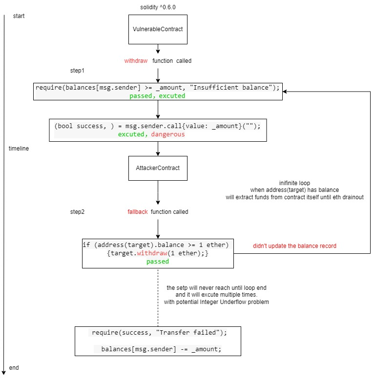

# 重入攻击 (Reentrancy Attack)

[The Dao 攻击事件](https://zhuanlan.zhihu.com/p/52098416)

在区块链和去中心化应用 (DApps) 的世界中，智能合约扮演着至关重要的角色。它们以代码的形式定义了资产的管理和逻辑的执行，但在其强大功能背后，也潜藏着安全风险。**重入攻击 (Reentrancy Attack)** 是以太坊等区块链平台上最著名且最具破坏性的智能合约漏洞之一。理解其原理、影响和防御方法对于开发者和用户都至关重要。

**什么是重入攻击？**

重入攻击是一种利用智能合约在与外部合约交互后，但在完成内部状态更新之前，允许外部（通常是恶意的）合约重新调用自身函数的漏洞。简单来说，它允许攻击者在合约完成一次操作的完整流程之前，再次触发该操作，从而可能导致非预期的状态改变，例如重复提取资金。

**重入攻击的经典场景：The DAO 事件**

重入攻击最为人所知的案例莫过于 2016 年发生的 The DAO (Decentralized Autonomous Organization) 事件。The DAO 是一个基于以太坊的去中心化风险投资基金，其智能合约存在重入漏洞。攻击者利用该漏洞，在 The DAO 合约向其发送 ETH 的过程中，通过精心构造的恶意合约多次重新调用 The DAO 的提款函数，最终窃取了当时价值数百万美元的 ETH。

**重入攻击的技术原理**

理解重入攻击的关键在于把握智能合约执行的顺序以及外部调用可能带来的影响。当合约 A 调用另一个合约 B 的函数时，控制权会暂时转移到合约 B。如果合约 B 在执行过程中又回调（call back）合约 A 的某个函数，这就为重入创造了机会。

如果合约 A 在发起对合约 B 的调用后，**先执行了外部调用，然后再更新内部状态**（例如记录已发送的金额），那么恶意合约 B 在回调合约 A 时，合约 A 的状态可能仍然处于“未完成”的状态。攻击者可以利用这个时间差，再次调用合约 A 的关键函数（例如提款），因为此时合约 A 仍然认为之前的操作尚未完成，从而允许重复执行。

**一个简化的代码示例 (存在重入漏洞)：**

可以直接放入 [remix](https://remix.ethereum.org/) 测试

```solidity
pragma solidity ^0.6.2;

contract VulnerableContract {
    mapping(address => uint256) public balances;

    function deposit() public payable {
        balances[msg.sender] += msg.value;
    }

    function withdraw(uint256 _amount) public {
        require(balances[msg.sender] >= _amount, "Insufficient balance");
        // 存在漏洞：先进行外部调用，后更新状态

        (bool success, ) = msg.sender.call{value: _amount}("");
        require(success, "Transfer failed");

        balances[msg.sender] -= _amount;
    }
}

contract AttackerContract {
    VulnerableContract public target;

    constructor(VulnerableContract _target) public {
        target = _target;
    }

    function attack() public payable {
        target.deposit{value: 1 ether}(); // 存入一些 ETH 以触发漏洞
        target.withdraw(1 ether); // 触发提款，控制权转移到 AttackerContract 的 fallback 函数
    }

    fallback() external payable {
        if (address(target).balance >= 1 ether) {
            target.withdraw(1 ether); // 再次调用提款函数，发生重入
        }
    }
}
```

在上面的例子中，`VulnerableContract` 的 `withdraw` 函数在向调用者发送 ETH 之后才更新 `balances`。恶意合约 `AttackerContract` 在收到第一次 ETH 时，其 `fallback` 函数被触发，它可以再次调用 `VulnerableContract` 的 `withdraw` 函数。由于 `VulnerableContract` 尚未更新其 `balances`，它会再次认为 `AttackerContract` 拥有足够的余额进行提款，从而导致攻击者可以提取超出其应得的资金。



**重入攻击的类型**

重入攻击可以分为以下几种类型：

- **外部函数调用重入:** 如上述示例，攻击者通过回调函数重新进入原始合约。
- **跨合约重入:** 攻击者利用一个合约调用另一个合约，而第二个合约又回调第一个合约的情况。
- **多重重入:** 攻击者可以进行多次嵌套的重入调用，进一步扩大损失。

**如何防御重入攻击？**

为了防止重入攻击，开发者应该遵循以下最佳实践：

1.  **Checks-Effects-Interactions 模式:** 这是最推荐的防御方法。在与外部合约交互之前，完成所有必要的检查（例如余额是否足够），然后更新合约的内部状态，最后再进行外部调用。

    ```solidity
    function withdraw(uint256 _amount) public {
        require(balances[msg.sender] >= _amount, "Insufficient balance");

        // 先更新状态
        balances[msg.sender] -= _amount;

        // 再进行外部调用
        (bool success, ) = msg.sender.call{value: _amount}("");
        require(success, "Transfer failed");
    }
    ```

2.  **互斥锁 (Mutex) 或状态变量:** 使用状态变量或修饰器来限制关键函数在同一时间只能被一个调用者执行，防止在外部调用返回之前再次进入。

    ```solidity
    bool private withdrawing;

    modifier nonReentrant() {
        require(!withdrawing, "ReentrancyGuard: reentrant call");
        withdrawing = true;
        _;
        withdrawing = false;
    }

    function withdraw(uint256 _amount) public nonReentrant {
        // ... (提款逻辑) ...
    }
    ```

3.  **使用 `transfer()` 或 `send()` (谨慎使用):** 这两种方法在发送 ETH 时会限制外部调用的 Gas 量，通常不足以进行深度的重入攻击。然而，它们也存在一些限制（例如 Gas 限制可能在未来发生变化，且不适用于所有类型的外部调用），因此不应作为主要的防御手段，而应与其他更可靠的方法结合使用。

4.  **OpenZeppelin 的 `ReentrancyGuard` 库:** 这是一个经过广泛测试和社区认可的库，提供了 `@nonReentrant` 修饰器，可以轻松地为关键函数添加重入保护。

**结论**

重入攻击是智能合约安全领域一个重要的威胁，其历史案例警示着开发者在设计和实现合约时必须高度重视安全性。通过理解重入攻击的原理并采用正确的防御措施，我们可以构建更安全、更可靠的去中心化应用，保护用户和平台的资产安全。始终遵循安全最佳实践，进行充分的代码审查和测试，是防范此类漏洞的关键。
