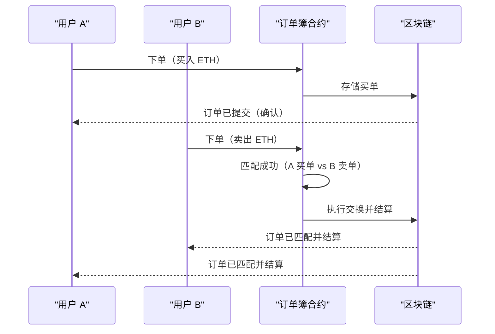
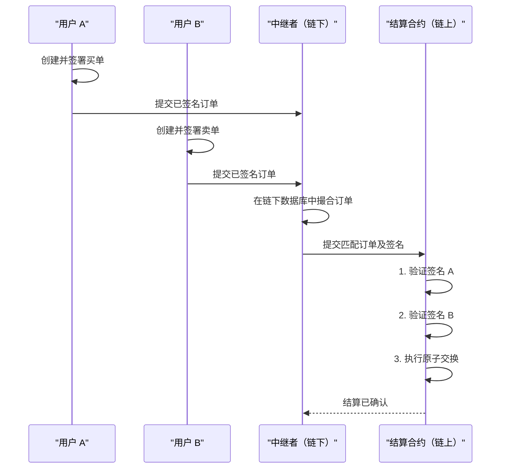
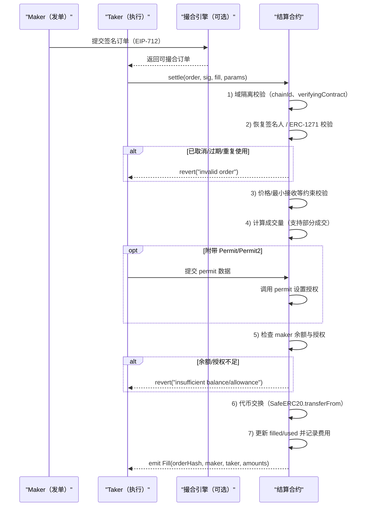

# Web3 交易所核心：订单撮合机制深度解析

## 摘要

在金融世界中，交易所的核心功能是“撮合”——将买家的订单与卖家的订单匹配以促成交易。当我们将交易所迁移到 Web3 和区块链上时，如何在去中心化、安全和高效之间找到平衡，成为一个巨大的挑战。本文将深入探讨 Web3 交易所（特别是去中心化交易所，DEX）中主流的订单撮合机制，分析其设计思路、优缺点，并通过流程图展示其运作方式。

---

## 1. 基础：什么是订单簿 (Order Book)？

在讨论撮合机制之前，我们必须先理解**订单簿**。这是一个包含特定资产所有未成交买单（Bids）和卖单（Asks）的实时列表。

-   **买单 (Bids)**：代表买家愿意以特定价格购买的数量。
-   **卖单 (Asks)**：代表卖家愿意以特定价格出售的数量。
-   **价差 (Spread)**：最高买单价和最低卖单价之间的差距。

当一个新的买单价格高于或等于最低卖单价，或者一个新的卖单价格低于或等于最高买单价时，**撮合引擎 (Matching Engine)** 就会执行交易。这个过程就是**订单撮合**。

---

## 2. 核心挑战：在区块链上实现订单簿

将传统的订单簿模型直接搬到 Layer-1 区块链（如以太坊主网）上会遇到几个严重的问题，这源于区块链的“不可能三角”——去中心化、安全、可扩展性：

1.  **成本高昂**：在以太坊上，每一个操作（下单、取消订单、修改订单）都需要作为一笔交易上链，并支付 Gas 费。在高频交易场景下，这笔费用会变得无法承受。
2.  **速度缓慢**：交易需要等待下一个区块才能被确认，延迟通常在十几秒到几分钟不等，这对于需要快速响应市场变化的交易者是致命的。
3.  **抢跑交易 (Front-running)**：由于交易在被打包进区块前会进入公开的内存池 (Mempool)，恶意的矿工或机器人可以观察到即将到来的大额订单，并抢先执行自己的交易来获利，损害了原始用户的利益。

为了克服这些挑战，Web3 社区探索出了几种不同的订单撮合架构。

---

## 3. 主流订单撮合机制的设计与对比

### 模式一：完全链上订单簿 (Fully On-Chain Order Book)

这是最符合去中心化理想的模型，所有订单的生命周期——提交、存储、撮合、取消——都在链上通过智能合约完成。

-   **工作流程**:
    1.  用户 A 调用智能合约的 `placeOrder` 函数，提交一个买单。这笔交易被打包上链，订单被存储在合约中。
    2.  用户 B 调用 `placeOrder` 函数，提交一个价格匹配的卖单。
    3.  智能合约的撮合逻辑被触发，识别到这两个订单可以匹配。
    4.  合约自动执行资产交换，将资产分别发送给 A 和 B。

-   **Mermaid 流程图**:

-   **优点**:
    *   **完全去中心化和抗审查**：没有单点故障或控制方。
    *   **透明可信**：所有操作都在链上公开可验证。
-   **缺点**:
    *   **极度昂贵和缓慢**：如前所述，每个操作都需要 Gas 和区块确认时间。
    *   **抢跑风险高**：所有意图都暴露在内存池中。
-   **适用场景**:
    *   几乎不适用于高频交易。仅在 Layer-2 或高性能专用链上才变得有可行性。

### 模式二：链下撮合，链上结算 (Off-Chain Matching, On-Chain Settlement)

这是目前最主流和实用的订单簿 DEX 模型，也被称为**混合模型 (Hybrid Model)**。它将计算密集型且需要高速响应的订单管理和撮合过程移至链下，仅将最终的交易结果上链进行结算。

-   **工作流程**:
    1.  用户 A 在前端界面上创建一个买单，然后用自己的私钥对这个订单数据进行**签名**，这不消耗 Gas。
    2.  这个经过签名的订单被发送到一个中心化的**中继方 (Relayer)** 的服务器上。
    3.  用户 B 同样签名一个卖单，并发送给同一个 Relayer。
    4.  Relayer 的撮合引擎在自己的链下数据库中匹配这两个订单。
    5.  一旦匹配成功，Relayer 会将 A 和 B 的两个签名订单捆绑在一起，打包成一笔交易，并调用链上的**结算合约 (Settlement Contract)**。
    6.  结算合约在链上验证 A 和 B 的签名是否有效，并检查他们是否有足够的资产。验证通过后，合约执行原子化的资产交换。

-   **Mermaid 流程图**:

-   **优点**:
    *   **用户体验好**：下单和取消订单免费且即时。
    *   **成本低**：只有在交易成功撮合后才需要支付一次性的链上结算 Gas 费（通常由 Taker 或 Relayer 支付）。
    *   **高性能**：撮合速度接近中心化交易所。
    *   **抗抢跑**：由于撮合过程在链下，抢跑者无法在内存池中提前发现订单。
-   **缺点**:
    *   **中心化风险**：Relayer 成为一个中心化组件。它可能会审查订单、选择性撮合，甚至宕机导致服务中断。（可以通过去中心化的 Relayer 网络缓解，如 0x Protocol）。
    *   **非托管性**：尽管 Relayer 无法偷走用户的资金（因为没有私钥），但它在撮合环节引入了中心化信任。
-   **代表项目**:
    *   **0x Protocol**, **dYdX (早期版本)**, **Loopring**。

### 模式三：自动做市商 (Automated Market Maker, AMM)

虽然 AMM 不使用传统的订单簿和撮合引擎，但它作为一种去中心化的交易机制，是理解 DEX 生态的关键。它通过算法和流动性池来自动定价和执行交易。

-   **工作流程**:
    1.  流动性提供者 (LP) 将两种代币存入一个资金池。
    2.  当用户想要交易时，他们与资金池进行交互，而不是与另一个交易者。
    3.  价格由池中两种代币的比例决定，通常遵循一个确定性算法，如 Uniswap 的 `x * y = k`。
-   **优点**:
    *   **始终有流动性**：只要池中有资金，交易就可以随时进行，无需等待对手方。
    *   **完全去中心化和无需许可**。
-   **缺点**:
    *   **滑点 (Slippage)**：大额交易会显著影响价格。
    *   **无常损失 (Impermanent Loss)**：对流动性提供者有风险。
    *   **无法挂限价单**：只能以当前市场价（或滑点范围内）进行交易。
-   **代表项目**:
    *   **Uniswap**, **Curve**, **Balancer**。

---

## 4. 总结与展望

| 特性 | 完全链上订单簿 | 链下撮合，链上结算 | 自动做市商 (AMM) |
| :--- | :--- | :--- | :--- |
| **去中心化程度** | 最高 | 中等（依赖 Relayer） | 高 |
| **交易速度** | 慢 (区块时间) | 快 (链下撮合) | 中等 (区块时间) |
| **交易成本** | 非常高 | 低（仅结算） | 中等（单次 Swap） |
| **用户体验** | 差 | 好 | 好 |
| **支持订单类型** | 市价单、限价单 | 市价单、限价单 | 仅市价单 |
| **抗抢跑性** | 差 | 好 | 中等（有 MEV 风险） |

**结论：**

在当前的区块链技术（特别是 Layer-1）限制下，**“链下撮合，链上结算”的混合模型** 是实现高性能、低成本订单簿 DEX 的最佳方案，它在用户体验和去中心化之间取得了巧妙的平衡。

与此同时，**AMM** 以其简洁和完全去中心化的特性，开辟了另一条成功的道路，并成为目前 DeFi 领域交易量最大的模式。

展望未来，随着 Layer-2 扩容方案（如 ZK-Rollups 和 Optimistic Rollups）的成熟，交易成本将大幅降低，执行速度显著提升。这可能会让**完全链上订单簿**模型重新焕发生机，在高性能的 L2 环境中实现接近中心化交易所的体验，同时保留区块链的去中心化和安全优势。

---

## 5. 深入：链下撮合、链上结算的安全与验证

本节补充“链下撮合、链上结算”模式的关键设计点，涵盖签名与域隔离、价格与数量校验、余额与授权检查、部分成交与取消、以及前置/抢跑的缓解手段。

### 5.1 参与方与职责
- Maker（发单方）：签名授权愿意成交的代币、价格/数量、有效期、是否允许部分成交等约束。
- Taker（吃单/执行）：选择订单并发起链上结算，或委托撮合引擎代为执行。
- Relayer/撮合引擎：聚合订单与撮合配对，可代付 Gas 并收取撮合费（可选）。
- 结算合约：验证签名与约束、检查余额与授权、执行代币交换、记录成交与取消状态。

### 5.2 订单结构与签名（EIP‑712）
- 常见字段：`maker`、`taker（可选）`、`sellToken`、`buyToken`、`sellAmount`、`minBuyAmount/price`、`deadline`、`nonce/salt`、`receiver`、`feeRecipient`、`feeBps/feeAmount`、`chainId`、`verifyingContract`、`partialFill` 等。
- 签名：使用 EIP‑712 Typed Data。Domain 至少包含 `name`、`version`、`chainId`、`verifyingContract`，避免跨链/跨合约重放。
- 支持合约署名：如机构账户用 ERC‑1271 校验。

### 5.3 结算合约验证流程（关键步骤）
- 域隔离：校验 `chainId` 与 `verifyingContract` 是否匹配。
- 签名恢复：`ecrecover`/OpenZeppelin ECDSA 或 ERC‑1271 验证签名者为 `maker`。
- 期限/重放保护：检查 `deadline`、`used[orderHash]` 与 `filled[orderHash]`（允许部分成交时按累计量校验）。
- 价格与数量约束：校验 `sell/buy` 方向相反，成交量满足双方最小接收/价格区间；计算填单量的取整方向需固定，避免被四舍五入套利。
- 授权与余额：
  - 非托管：检查 `balanceOf(maker)` 与 `allowance(maker, settlement)` 是否足够。
  - 可选即刻授权：支持 EIP‑2612/Permit2，先 `permit` 再结算，减少“授权被用户修改导致失败”。
- 代币转账：使用 `SafeERC20` 做 `transferFrom`，考虑非标准返回值与税/通缩代币；费用按约定结算给 `feeRecipient`。
- 状态更新与事件：更新 `filled/used`，`emit` 成交事件，便于索引与审计。

### 5.4 防止用户在执行前转走资产
- 无法从协议层“禁止”用户转资；常见策略是：
  - 即刻授权（Permit/Permit2）减少失败概率；
  - 上链前仿真（eth_call/Tenderly）检查余额与可行性；
  - 指定 `taker` + 短 `deadline`，缩短状态变化窗口；
  - 托管/预存模式（在合约/二层账户中持有余额），以可用余额为准保障执行确定性。

### 5.5 取消与部分成交
- 取消：提供 `cancel(orderHash)` 或 `cancelUpTo(nonceFloor)`，也可签名“取消指令”由第三方代上链。
- 部分成交：`filled[orderHash]` 记录累计成交量，完全成交或取消后标记 `used = true`，禁止再次使用。

### 5.6 防前置/抢跑（MEV）
- 绑定 `taker/执行者` 限定可执行主体；
- 使用私有内存池/保护中继（如 Flashbots）；
- 短有效期与撮合域隔离；必要时加密订单、仅对特定执行者可见。

### 5.7 费用与结算
- 在订单中明确 `feeRecipient` 与 `feeBps/feeAmount`；
- 费用币种可为买/卖任一侧或独立 `feeToken`；
- 对税/通缩代币，按“实际到帐量”设计约束，或直接在白名单外禁用。

### 5.8 时序图（含签名校验、授权检查、部分成交与取消）

