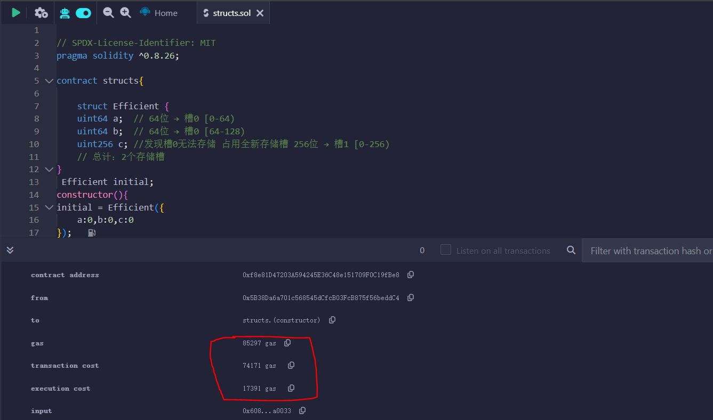
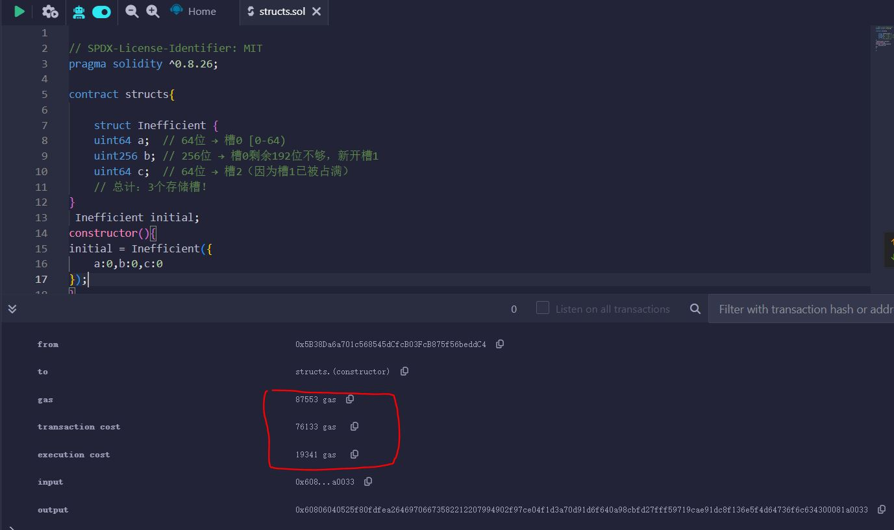

# 针对数据类型和数据结构的优化

在 Solidity 中，合理选择数据结构和优化数据大小可以显著降低 Gas 消耗。以下是一些关键优化策略：

**基本常识：**

- **变量存储槽 (Storage Slot) 大小:** 在以太坊的 EVM (以太坊虚拟机) 中，用于存储合约状态变量的存储空间被划分为一个个大小为 **256 位 (32 字节)** 的存储槽。每个状态变量都会被分配到一个或多个连续的存储槽。

- **变量三种声明 (数据位置 - Data Location):** 在 Solidity 中，变量可以声明在三个不同的数据位置，这决定了变量的生命周期和存储方式：

  1.  **`memory`:**

      - 用于存储**函数调用期间**的临时变量。
      - 当函数执行结束时，`memory` 中分配的内存会被自动释放。
      - `memory` 中的变量是不可持久化的，合约的状态不会保存在 `memory` 中。
      - 函数参数（除了 `storage` 类型）、局部变量以及使用 `new` 关键字创建的动态类型（如动态数组、`bytes` 和 `string`）默认声明在 `memory` 中。

  2.  **`calldata`:**

      - 用于存储**函数调用的输入数据**。
      - 类似于 `memory`，`calldata` 中的数据也是临时的，在函数调用结束后失效。
      - `calldata` 主要用于接收外部函数调用的参数，特别是结构体或动态数组等复杂类型。
      - `calldata` 的一个重要特性是它是**只读的**，你不能修改 `calldata` 中的数据。这有助于节省 Gas。
      - 外部函数的参数默认声明在 `calldata` 中。

  3.  **`storage`:**
      - 用于存储**合约的状态变量**。
      - `storage` 中的数据是**持久化**的，会存储在区块链的状态中，并且在合约的所有函数调用之间都保持不变。
      - 访问和修改 `storage` 中的数据通常比 `memory` 和 `calldata` 更昂贵 (消耗更多的 Gas)。
      - 在合约中直接声明的变量（在函数外部）默认声明在 `storage` 中。

**总结一下它们的主要区别：**

<table>
  <tr>
    <th>特性</th>
    <th><code>memory</code></th>
    <th><code>calldata</code></th>
    <th><code>storage</code></th>
  </tr>
  <tr>
    <td><strong>存储位置</strong></td>
    <td>EVM 的临时内存</td>
    <td>函数调用的输入数据</td>
    <td>区块链的状态存储</td>
  </tr>
  <tr>
    <td><strong>生命周期</strong></td>
    <td>函数调用期间</td>
    <td>函数调用期间</td>
    <td>合约的整个生命周期</td>
  </tr>
  <tr>
    <td><strong>持久性</strong></td>
    <td>非持久化</td>
    <td>非持久化</td>
    <td>持久化</td>
  </tr>
  <tr>
    <td><strong>可修改性</strong></td>
    <td>可读写</td>
    <td>只读</td>
    <td>可读写</td>
  </tr>
  <tr>
    <td><strong>Gas 成本</strong></td>
    <td>相对较低</td>
    <td>相对较低</td>
    <td>相对较高</td>
  </tr>
  <tr>
    <td><strong>默认用于</strong></td>
    <td>函数局部变量、<code>new</code> 创建的动态类型</td>
    <td>外部函数参数</td>
    <td>合约状态变量</td>
  </tr>
</table>

## 基本数据类型优化

**使用最小够用的数据类型**：

- `uint8` 而非 `uint256`（当数值范围允许时）
- `bytes1` 到 `bytes32` 而非 `bytes` 或 `string`（对于固定长度数据）

---

**变量打包**：

- 变量打包机制:EVM 会按照合约声明的变量顺序进行打包，一个存储槽无法将对应变量装入时会新增存储槽

#### **核心打包规则**

1. **顺序严格按声明顺序**  
   EVM 不会自动重新排序变量，而是严格按照结构体或合约中的定义顺序，**从左到右、从上到下**尝试打包。

2. **能打包的条件**

   - 当前存储槽剩余空间 ≥ 变量大小
   - 变量类型允许打包（动态数组、映射等复杂类型不能打包）

3. **打包失败时**  
   如果当前槽剩余空间不足，变量会占用一个**全新的存储槽**（即使它本身很小）。

---

### **实际案例对比**

#### 案例 1：**高效打包（节省 Gas）**

```solidity
struct Efficient {
    uint64 a;  // 64位 → 槽0 [0-64)
    uint64 b;  // 64位 → 槽0 [64-128)
    uint256 c; //发现槽0无法存储 占用全新存储槽 256位 → 槽1 [0-256)
    // 总计：2个存储槽
}
```



#### 案例 2：**未优化顺序（浪费 Gas）**

```solidity
struct Inefficient {
    uint64 a;  // 64位 → 槽0 [0-64)
    uint256 b; // 256位 → 槽0剩余192位不够，新开槽1
    uint64 c;  // 64位 → 槽2（因为槽1已被占满）
    // 总计：3个存储槽！
}
```



#### 案例 3：**动态类型无法打包**

```solidity
struct WithDynamic {
    uint64 a;      // 槽0 [0-64)
    string name;   // 动态类型，强制新开槽1
    uint64 b;      // 槽2（因为槽1被string占用）
    // 总计：3个存储槽
}
```

---

### **关键优化技巧**

1. **降序排列变量**  
   将 `uint256`、`bytes32` 等大类型放在前面，小类型（`uint64`、`bool` 等）放在后面，减少"碎片"。

   - 此处作为**功能开发完全**后进行的操作，通过变更数据位置而进一步优化。至于能否由小到大排序，自然也是可以的。不过这样要精确计算各变量能否组合，共同放入槽内，不如由大到小最后交给编译程序判断。

2. **避免穿插动态类型**  
   动态数组、映射、`string` 会强制新开槽，尽量将它们放在结构体末尾。

3. **显式使用 `uint` 打包**  
   如果变量逻辑相关，可以手动位操作打包到 `uint256` 中（极端优化场景用）。

4. **继承结构体的顺序**  
   父合约的变量优先存储，子合约的变量后续存储，需整体考虑打包。

## 数据结构选择

1. **数组优化**：

   - 对于小型固定集合，使用固定大小数组 `uint[10]` 而非动态数组 `uint[]`
   - 考虑使用 `bytes32[]` 而非 `uint256[]` 如果数据可以适应

2. **映射 vs 数组**：

   - 映射(`mapping`)通常比数组更省 Gas（特别是稀疏数据时）
   - 但需要遍历时数组更高效

3. **高效的结构体设计**：
   ```solidity
   struct GasEfficient {
       uint32 time;
       uint64 value;
       address user;  // 160位
       // 总共256位，正好一个存储槽
   }
   ```

## 存储布局优化

1. **变量顺序**：

   - 将一起使用的变量声明在一起，帮助编译器打包
   - 将`uint`和`bytes32`等 256 位类型放在前面

2. **存储与内存**：
   - 尽可能使用`memory`而非`storage`（内存操作更便宜）
   - 对临时变量使用`calldata`（最便宜）

## 高级技巧

1. **位压缩**：

   ```solidity
   uint256 packedData;

   function setData(uint16 a, uint16 b, uint16 c) internal {
       packedData = uint256(a) << 32 | uint256(b) << 16 | uint256(c);
   }
   ```

- 对于追求低存储空间占用的程序尤为有效。可以以同一个存储槽通过各个位级操作记录不同的信息。
- 比如 USDC 中占用最高位的 blacklist。在账户余额存储占用有限的状况下可以节省 1bit 作为账号是否拉黑的标记，而不用多生成一个 mapping。(详见代码分析篇)

2. **使用 EVM 字长**：

   - EVM 处理 256 位(32 字节)最有效
   - 即使小数据类型也会占用 256 位存储（除非打包）

3. **替代数据结构**：
   - 考虑使用 Merkle 树或 Patricia 树处理大量数据
   - 对于枚举类型，使用`uint8`足够

## 实际应用示例

```solidity
// 优化前
struct User {
    string name;  // 昂贵
    uint256 balance;
    uint256 lastActive;  // 时间戳不需要uint256
}

// 优化后
struct OptimizedUser {
    bytes32 name;  // 固定长度
    uint128 balance;  // 足够表示大多数代币金额
    uint64 lastActive;  // 足够表示到公元3000年
}
```

记住：在优化时要权衡 Gas 节省与代码可读性/维护性，过度优化有时会导致代码难以理解和维护。
