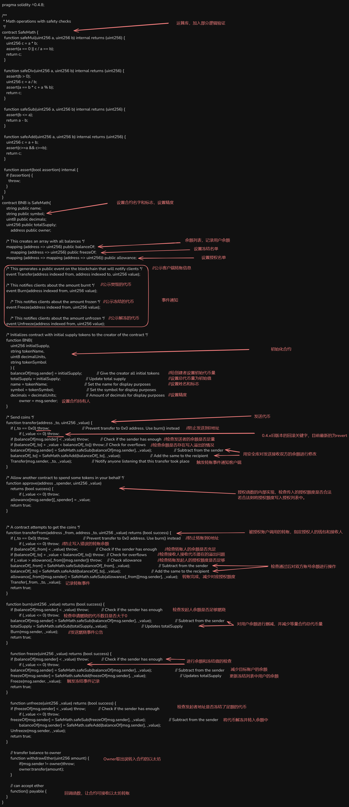

# BNB
以太坊地址[BNB](https://etherscan.io/address/0xb8c77482e45f1f44de1745f52c74426c631bdd52)



```solidity
pragma solidity ^0.4.8;

/**
 * Math operations with safety checks
 */
contract SafeMath {
  function safeMul(uint256 a, uint256 b) internal returns (uint256) {
    uint256 c = a * b;
    assert(a == 0 || c / a == b);
    return c;
  }

  function safeDiv(uint256 a, uint256 b) internal returns (uint256) {
    assert(b > 0);
    uint256 c = a / b;
    assert(a == b * c + a % b);
    return c;
  }

  function safeSub(uint256 a, uint256 b) internal returns (uint256) {
    assert(b <= a);
    return a - b;
  }

  function safeAdd(uint256 a, uint256 b) internal returns (uint256) {
    uint256 c = a + b;
    assert(c>=a && c>=b);
    return c;
  }

  function assert(bool assertion) internal {
    if (!assertion) {
      throw;
    }
  }
}
contract BNB is SafeMath{
    string public name;
    string public symbol;
    uint8 public decimals;
    uint256 public totalSupply;
	address public owner;

    /* This creates an array with all balances */
    mapping (address => uint256) public balanceOf;
	mapping (address => uint256) public freezeOf;
    mapping (address => mapping (address => uint256)) public allowance;

    /* This generates a public event on the blockchain that will notify clients */
    event Transfer(address indexed from, address indexed to, uint256 value);

    /* This notifies clients about the amount burnt */
    event Burn(address indexed from, uint256 value);
	
	/* This notifies clients about the amount frozen */
    event Freeze(address indexed from, uint256 value);
	
	/* This notifies clients about the amount unfrozen */
    event Unfreeze(address indexed from, uint256 value);

    /* Initializes contract with initial supply tokens to the creator of the contract */
    function BNB(
        uint256 initialSupply,
        string tokenName,
        uint8 decimalUnits,
        string tokenSymbol
        ) {
        balanceOf[msg.sender] = initialSupply;              // Give the creator all initial tokens
        totalSupply = initialSupply;                        // Update total supply
        name = tokenName;                                   // Set the name for display purposes
        symbol = tokenSymbol;                               // Set the symbol for display purposes
        decimals = decimalUnits;                            // Amount of decimals for display purposes
		owner = msg.sender;
    }

    /* Send coins */
    function transfer(address _to, uint256 _value) {
        if (_to == 0x0) throw;                               // Prevent transfer to 0x0 address. Use burn() instead
		if (_value <= 0) throw; 
        if (balanceOf[msg.sender] < _value) throw;           // Check if the sender has enough
        if (balanceOf[_to] + _value < balanceOf[_to]) throw; // Check for overflows
        balanceOf[msg.sender] = SafeMath.safeSub(balanceOf[msg.sender], _value);                     // Subtract from the sender
        balanceOf[_to] = SafeMath.safeAdd(balanceOf[_to], _value);                            // Add the same to the recipient
        Transfer(msg.sender, _to, _value);                   // Notify anyone listening that this transfer took place
    }

    /* Allow another contract to spend some tokens in your behalf */
    function approve(address _spender, uint256 _value)
        returns (bool success) {
		if (_value <= 0) throw; 
        allowance[msg.sender][_spender] = _value;
        return true;
    }
       

    /* A contract attempts to get the coins */
    function transferFrom(address _from, address _to, uint256 _value) returns (bool success) {
        if (_to == 0x0) throw;                                // Prevent transfer to 0x0 address. Use burn() instead
		if (_value <= 0) throw; 
        if (balanceOf[_from] < _value) throw;                 // Check if the sender has enough
        if (balanceOf[_to] + _value < balanceOf[_to]) throw;  // Check for overflows
        if (_value > allowance[_from][msg.sender]) throw;     // Check allowance
        balanceOf[_from] = SafeMath.safeSub(balanceOf[_from], _value);                           // Subtract from the sender
        balanceOf[_to] = SafeMath.safeAdd(balanceOf[_to], _value);                             // Add the same to the recipient
        allowance[_from][msg.sender] = SafeMath.safeSub(allowance[_from][msg.sender], _value);
        Transfer(_from, _to, _value);
        return true;
    }

    function burn(uint256 _value) returns (bool success) {
        if (balanceOf[msg.sender] < _value) throw;            // Check if the sender has enough
		if (_value <= 0) throw; 
        balanceOf[msg.sender] = SafeMath.safeSub(balanceOf[msg.sender], _value);                      // Subtract from the sender
        totalSupply = SafeMath.safeSub(totalSupply,_value);                                // Updates totalSupply
        Burn(msg.sender, _value);
        return true;
    }
	
	function freeze(uint256 _value) returns (bool success) {
        if (balanceOf[msg.sender] < _value) throw;            // Check if the sender has enough
		if (_value <= 0) throw; 
        balanceOf[msg.sender] = SafeMath.safeSub(balanceOf[msg.sender], _value);                      // Subtract from the sender
        freezeOf[msg.sender] = SafeMath.safeAdd(freezeOf[msg.sender], _value);                                // Updates totalSupply
        Freeze(msg.sender, _value);
        return true;
    }
	
	function unfreeze(uint256 _value) returns (bool success) {
        if (freezeOf[msg.sender] < _value) throw;            // Check if the sender has enough
		if (_value <= 0) throw; 
        freezeOf[msg.sender] = SafeMath.safeSub(freezeOf[msg.sender], _value);                      // Subtract from the sender
		balanceOf[msg.sender] = SafeMath.safeAdd(balanceOf[msg.sender], _value);
        Unfreeze(msg.sender, _value);
        return true;
    }
	
	// transfer balance to owner
	function withdrawEther(uint256 amount) {
		if(msg.sender != owner)throw;
		owner.transfer(amount);
	}
	
	// can accept ether
	function() payable {
    }
}
```