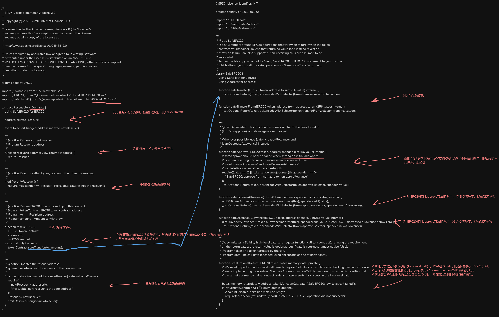

<a href="Rescuable.png" target="_blank"></a>


### Rescuable
```solidity
/**
 * SPDX-License-Identifier: Apache-2.0
 *
 * Copyright (c) 2023, Circle Internet Financial, LLC.
 *
 * Licensed under the Apache License, Version 2.0 (the "License");
 * you may not use this file except in compliance with the License.
 * You may obtain a copy of the License at
 *
 * http://www.apache.org/licenses/LICENSE-2.0
 *
 * Unless required by applicable law or agreed to in writing, software
 * distributed under the License is distributed on an "AS IS" BASIS,
 * WITHOUT WARRANTIES OR CONDITIONS OF ANY KIND, either express or implied.
 * See the License for the specific language governing permissions and
 * limitations under the License.
 */

pragma solidity 0.6.12;

import { Ownable } from "../v1/Ownable.sol";
import { IERC20 } from "@openzeppelin/contracts/token/ERC20/IERC20.sol";
import { SafeERC20 } from "@openzeppelin/contracts/token/ERC20/SafeERC20.sol";

contract Rescuable is Ownable {
    using SafeERC20 for IERC20;

    address private _rescuer;

    event RescuerChanged(address indexed newRescuer);

    /**
     * @notice Returns current rescuer
     * @return Rescuer's address
     */
    function rescuer() external view returns (address) {
        return _rescuer;
    }

    /**
     * @notice Revert if called by any account other than the rescuer.
     */
    modifier onlyRescuer() {
        require(msg.sender == _rescuer, "Rescuable: caller is not the rescuer");
        _;
    }

    /**
     * @notice Rescue ERC20 tokens locked up in this contract.
     * @param tokenContract ERC20 token contract address
     * @param to        Recipient address
     * @param amount    Amount to withdraw
     */
    function rescueERC20(
        IERC20 tokenContract,
        address to,
        uint256 amount
    ) external onlyRescuer {
        tokenContract.safeTransfer(to, amount);
    }

    /**
     * @notice Updates the rescuer address.
     * @param newRescuer The address of the new rescuer.
     */
    function updateRescuer(address newRescuer) external onlyOwner {
        require(
            newRescuer != address(0),
            "Rescuable: new rescuer is the zero address"
        );
        _rescuer = newRescuer;
        emit RescuerChanged(newRescuer);
    }
}
```

### SafeERC20.sol

```solidity
// SPDX-License-Identifier: MIT

pragma solidity >=0.6.0 <0.8.0;

import "./IERC20.sol";
import "../../math/SafeMath.sol";
import "../../utils/Address.sol";

/**
 * @title SafeERC20
 * @dev Wrappers around ERC20 operations that throw on failure (when the token
 * contract returns false). Tokens that return no value (and instead revert or
 * throw on failure) are also supported, non-reverting calls are assumed to be
 * successful.
 * To use this library you can add a `using SafeERC20 for IERC20;` statement to your contract,
 * which allows you to call the safe operations as `token.safeTransfer(...)`, etc.
 */
library SafeERC20 {
    using SafeMath for uint256;
    using Address for address;

    function safeTransfer(IERC20 token, address to, uint256 value) internal {
        _callOptionalReturn(token, abi.encodeWithSelector(token.transfer.selector, to, value));
    }

    function safeTransferFrom(IERC20 token, address from, address to, uint256 value) internal {
        _callOptionalReturn(token, abi.encodeWithSelector(token.transferFrom.selector, from, to, value));
    }

    /**
     * @dev Deprecated. This function has issues similar to the ones found in
     * {IERC20-approve}, and its usage is discouraged.
     *
     * Whenever possible, use {safeIncreaseAllowance} and
     * {safeDecreaseAllowance} instead.
     */
    function safeApprove(IERC20 token, address spender, uint256 value) internal {
        // safeApprove should only be called when setting an initial allowance,
        // or when resetting it to zero. To increase and decrease it, use
        // 'safeIncreaseAllowance' and 'safeDecreaseAllowance'
        // solhint-disable-next-line max-line-length
        require((value == 0) || (token.allowance(address(this), spender) == 0),
            "SafeERC20: approve from non-zero to non-zero allowance"
        );
        _callOptionalReturn(token, abi.encodeWithSelector(token.approve.selector, spender, value));
    }

    function safeIncreaseAllowance(IERC20 token, address spender, uint256 value) internal {
        uint256 newAllowance = token.allowance(address(this), spender).add(value);
        _callOptionalReturn(token, abi.encodeWithSelector(token.approve.selector, spender, newAllowance));
    }

    function safeDecreaseAllowance(IERC20 token, address spender, uint256 value) internal {
        uint256 newAllowance = token.allowance(address(this), spender).sub(value, "SafeERC20: decreased allowance below zero");
        _callOptionalReturn(token, abi.encodeWithSelector(token.approve.selector, spender, newAllowance));
    }

    /**
     * @dev Imitates a Solidity high-level call (i.e. a regular function call to a contract), relaxing the requirement
     * on the return value: the return value is optional (but if data is returned, it must not be false).
     * @param token The token targeted by the call.
     * @param data The call data (encoded using abi.encode or one of its variants).
     */
    function _callOptionalReturn(IERC20 token, bytes memory data) private {
        // We need to perform a low level call here, to bypass Solidity's return data size checking mechanism, since
        // we're implementing it ourselves. We use {Address.functionCall} to perform this call, which verifies that
        // the target address contains contract code and also asserts for success in the low-level call.

        bytes memory returndata = address(token).functionCall(data, "SafeERC20: low-level call failed");
        if (returndata.length > 0) { // Return data is optional
            // solhint-disable-next-line max-line-length
            require(abi.decode(returndata, (bool)), "SafeERC20: ERC20 operation did not succeed");
        }
    }
}
```