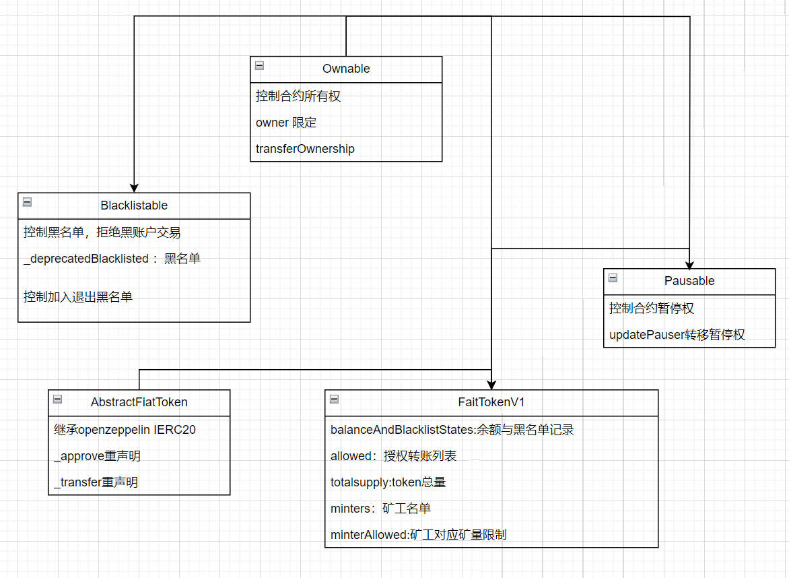

# USDC源码解析
[USDC 源码链接](https://etherscan.io/token/0xa0b86991c6218b36c1d19d4a2e9eb0ce3606eb48#code)

V1设计结构

## 逐模块分析

### FiatTokenV1.sol  (主要实现)
[FiatTokenV1](./sourcecode/FiatTokenV1/FiatTokenV1.md)

### ownable.sol
[ownable](./sourcecode/Ownable/Ownable.md)

### pauseable.sol
[pauseable](./sourcecode/Pauseable/Pauseable.md)

### AbstractFiatTokenV1.sol
[AbstractFiatTokenV1](./sourcecode/AbstractFiatTokenV1/AbstractFiatTokenV1.md)

### Blacklistable.sol
[Blacklistable](./sourcecode/Blacklistable/Blacklistable.md)

