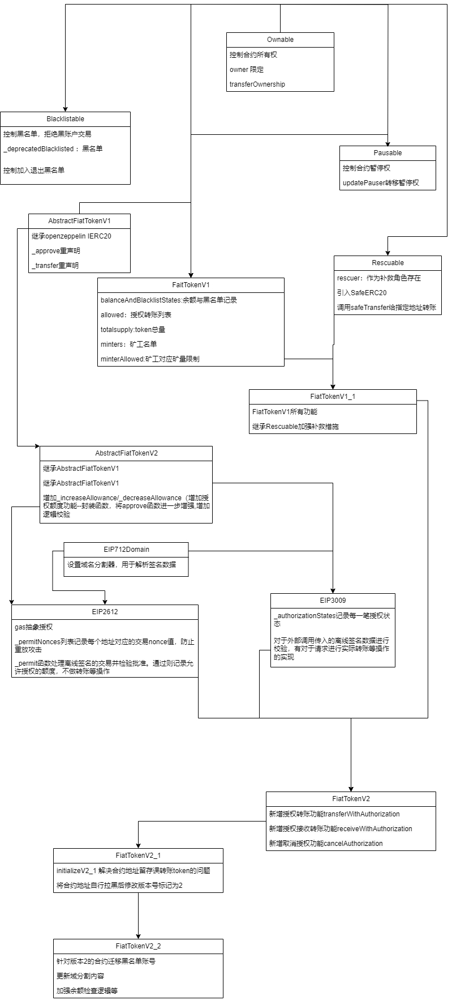

# USDC_V2源码解析

V2设计结构

## 逐模块分析

### AbstractFiatTokenV2.sol
[AbstractFiatTokenV2](./sourcecode/AbstractFiatTokenV2/AbstractFiatTokenV2.md)

### EIP712Domain.sol
[EIP712Domain](./sourcecode/EIP712Domian/EIP712Domain.md)

### EIP2612.sol
[EIP2612](./sourcecode/EIP2612/EIP2612.md)

### EIP3009.sol
[EIP3009](./sourcecode/EIP3009/EIP3009.md)

### FiatTokenV2.sol  (重要)
[FiatTokenV2](./sourcecode/FiatTokenV2/FiatTokenV2.md)

### FiatTokenV2_1.sol （重要）
[FiatTokenV2_1](./sourcecode/FiatTokenV2_1/FiatTokenV2_1.md)

### FiatTokenV2_2.sol (重要)
[FiatTokenV2_2](./sourcecode/FiatTokenV2_2/FiatTokenV2_2.md)