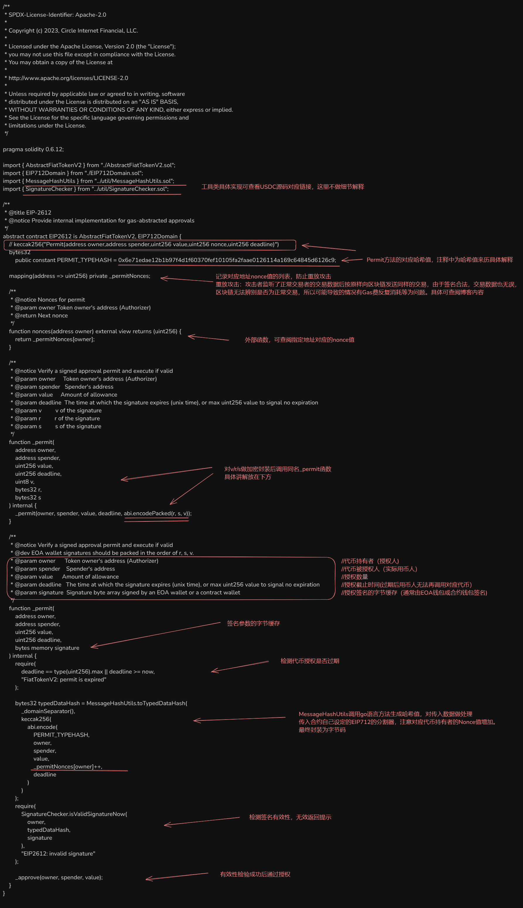

# EIP2612
>EIP2612题案细节及功能详见链接[EIP2612](/src/BlockChain/Ethereum/ERC/ERC2612.md)。此小结中为USDC重写的对应功能

这段代码实现了EIP-2612标准，是一个用于以太坊代币的"permit"功能的智能合约实现。
主要功能
EIP-2612实现了一种称为"gas抽象授权"(gas-abstracted approvals)的机制，它允许用户通过签名来授权第三方花费他们的代币，而不需要自己支付gas费用进行交互。
## 关键组件

- PERMIT_TYPEHASH：用于EIP-712结构化数据签名的类型哈希常量。
- _permitNonces映射：跟踪每个地址的nonce值，以防止[重放攻击](https://zhuanlan.zhihu.com/p/163121813)。
- nonces函数：公开查询特定地址的当前nonce。
- _permit函数：核心功能，有两个版本：
- 一个接受v, r, s分离的签名参数
- 一个接受整合的signature字节数组


## 工作流程

代币持有者(owner)离线签署一个包含以下信息的消息：

- 自己的地址(owner)
- 被授权者地址(spender)
- 授权金额(value)
- 当前nonce值
- 授权截止时间(deadline)


签名后，任何人可以将这个签名提交到合约。
合约验证：

- 检查截止时间是否有效
- 使用EIP-712构建相同的消息哈希
- 验证签名是否匹配owner地址
- 增加owner的nonce值
- 执行实际的approve操作


实际应用场景
这个功能解决了以太坊代币使用的一个主要摩擦点：用户需要进行两次交易才能通过第三方服务使用代币：

首先批准第三方花费代币
然后实际使用第三方服务

使用EIP-2612，用户只需签名一个许可消息（不需要支付gas），然后第三方可以在同一笔交易中验证许可并使用代币，大大改善了用户体验。

## 技术细节

基于Solidity 0.6.12
实现了EIP-712标准进行结构化数据签名
支持智能合约钱包签名验证（通过SignatureChecker）
可以设置永不过期的授权（通过设置deadline为最大uint256值）

这是一个关键的DeFi基础设施组件，特别适用于稳定币等高频使用的代币，可以显著降低用户与DeFi协议交互的成本和复杂性。




```solidity
/**
 * SPDX-License-Identifier: Apache-2.0
 *
 * Copyright (c) 2023, Circle Internet Financial, LLC.
 *
 * Licensed under the Apache License, Version 2.0 (the "License");
 * you may not use this file except in compliance with the License.
 * You may obtain a copy of the License at
 *
 * http://www.apache.org/licenses/LICENSE-2.0
 *
 * Unless required by applicable law or agreed to in writing, software
 * distributed under the License is distributed on an "AS IS" BASIS,
 * WITHOUT WARRANTIES OR CONDITIONS OF ANY KIND, either express or implied.
 * See the License for the specific language governing permissions and
 * limitations under the License.
 */

pragma solidity 0.6.12;

import { AbstractFiatTokenV2 } from "./AbstractFiatTokenV2.sol";
import { EIP712Domain } from "./EIP712Domain.sol";
import { MessageHashUtils } from "../util/MessageHashUtils.sol";
import { SignatureChecker } from "../util/SignatureChecker.sol";

/**
 * @title EIP-2612
 * @notice Provide internal implementation for gas-abstracted approvals
 */
abstract contract EIP2612 is AbstractFiatTokenV2, EIP712Domain {
    // keccak256("Permit(address owner,address spender,uint256 value,uint256 nonce,uint256 deadline)")
    bytes32
        public constant PERMIT_TYPEHASH = 0x6e71edae12b1b97f4d1f60370fef10105fa2faae0126114a169c64845d6126c9;

    mapping(address => uint256) private _permitNonces;

    /**
     * @notice Nonces for permit
     * @param owner Token owner's address (Authorizer)
     * @return Next nonce
     */
    function nonces(address owner) external view returns (uint256) {
        return _permitNonces[owner];
    }

    /**
     * @notice Verify a signed approval permit and execute if valid
     * @param owner     Token owner's address (Authorizer)
     * @param spender   Spender's address
     * @param value     Amount of allowance
     * @param deadline  The time at which the signature expires (unix time), or max uint256 value to signal no expiration
     * @param v         v of the signature
     * @param r         r of the signature
     * @param s         s of the signature
     */
    function _permit(
        address owner,
        address spender,
        uint256 value,
        uint256 deadline,
        uint8 v,
        bytes32 r,
        bytes32 s
    ) internal {
        _permit(owner, spender, value, deadline, abi.encodePacked(r, s, v));
    }

    /**
     * @notice Verify a signed approval permit and execute if valid
     * @dev EOA wallet signatures should be packed in the order of r, s, v.
     * @param owner      Token owner's address (Authorizer)
     * @param spender    Spender's address
     * @param value      Amount of allowance
     * @param deadline   The time at which the signature expires (unix time), or max uint256 value to signal no expiration
     * @param signature  Signature byte array signed by an EOA wallet or a contract wallet
     */
    function _permit(
        address owner,
        address spender,
        uint256 value,
        uint256 deadline,
        bytes memory signature
    ) internal {
        require(
            deadline == type(uint256).max || deadline >= now,
            "FiatTokenV2: permit is expired"
        );

        bytes32 typedDataHash = MessageHashUtils.toTypedDataHash(
            _domainSeparator(),
            keccak256(
                abi.encode(
                    PERMIT_TYPEHASH,
                    owner,
                    spender,
                    value,
                    _permitNonces[owner]++,
                    deadline
                )
            )
        );
        require(
            SignatureChecker.isValidSignatureNow(
                owner,
                typedDataHash,
                signature
            ),
            "EIP2612: invalid signature"
        );

        _approve(owner, spender, value);
    }
}
```