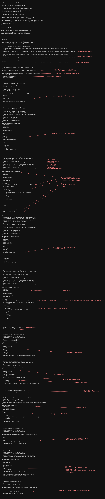

# EIP3009

这段代码实现了EIP-3009标准，提供了一种气体抽象转账（gas-abstracted transfers）的内部实现。

### 主要功能

EIP-3009允许用户通过离线签名消息授权他人代表自己执行代币转账，而无需亲自支付气体费用。这种模式类似于EIP-2612的授权机制，但专注于直接转账操作。

### 核心组件

1. **三种类型的交易**：
   - `transferWithAuthorization`: 任何人都可以提交已签名的转账授权
   - `receiveWithAuthorization`: 只有指定的接收者可以提交已签名的转账授权
   - `cancelAuthorization`: 允许签名者取消之前未使用的授权

2. **授权状态跟踪**：
   - 使用`_authorizationStates`双重映射跟踪每个授权者的每个nonce的使用状态
   - 每个授权使用随机生成的32字节nonce来确保唯一性

3. **事件通知**：
   - `AuthorizationUsed`: 当授权被使用时发出
   - `AuthorizationCanceled`: 当授权被取消时发出

### 工作流程

1. **创建授权**：
   - 用户离线签署包含转账详情的消息（发送方、接收方、金额、有效期、nonce）
   - 签名使用EIP-712标准格式化数据以提高可读性和安全性

2. **提交授权**：
   - 对于`transferWithAuthorization`：任何人都可以提交授权
   - 对于`receiveWithAuthorization`：只有指定的接收方可以提交（防止抢跑攻击）

3. **验证机制**：
   - 确保授权在有效时间范围内
   - 验证nonce未被使用
   - 验证签名的有效性
   - 标记授权为已使用
   - 执行实际转账

### 技术亮点

1. **灵活的安全性**：
   - 支持时间窗口限制（validAfter/validBefore）
   - 支持取消未使用的授权
   - 支持智能合约钱包的签名（通过SignatureChecker）

2. **改进的用户体验**：
   - 用户可以离线签署多个转账
   - 接收方或第三方可代付气体费用
   - 允许创建未来生效的授权

3. **防止常见攻击**：
   - 使用nonce防止重放攻击
   - `receiveWithAuthorization`特别增加了调用者验证，防止抢跑

### 实际应用场景

1. **代付费用交易**：第三方可以为用户支付气体费用
2. **批量处理**：离线收集多个签名后一次性处理
3. **延迟执行**：设置未来时间窗口的授权
4. **接收方发起**：允许接收方通过`receiveWithAuthorization`主动提取授权的资金

这种模式极大地提高了代币的使用灵活性，特别适用于稳定币和高频使用的代币，可以明显降低与DeFi协议交互的摩擦成本。它与EIP-2612（授权机制）相辅相成，共同构成现代代币标准的重要组成部分。


### 离线签署的基本原理

用户不需要直接与区块链交互，而是在自己的设备上创建并签署一条消息，这条消息包含了转账的所有必要信息。直接的理解就是写支票给别人去银行兑现，自己在这过程中无需与银行沟通。

### 签署过程详解

1. **构建结构化数据**：
   - 根据交易类型（转账、接收或取消），构建一个遵循EIP-712标准的结构化数据
   - 包含发送方地址、接收方地址、金额、有效时间、nonce等信息

2. **创建消息哈希**：
   - 使用typeHash（如`TRANSFER_WITH_AUTHORIZATION_TYPEHASH`）
   - 将所有参数编码：`abi.encode(TYPEHASH, from, to, value, validAfter, validBefore, nonce)`
   - 对编码后的数据进行keccak256哈希

3. **应用EIP-712域分隔符**：
   - 将消息哈希与域分隔符(`_domainSeparator()`)结合
   - 使用`MessageHashUtils.toTypedDataHash()`方法生成最终待签名哈希

4. **使用私钥签名**：
   - 用户使用自己的私钥对最终哈希进行签名
   - 生成签名组件(v, r, s)或打包的签名字节数组

### 代码中的实现

在代码中，这个过程对应于：

```solidity
// 创建消息哈希
bytes32 dataHash = keccak256(
    abi.encode(
        TRANSFER_WITH_AUTHORIZATION_TYPEHASH,
        from,
        to,
        value,
        validAfter,
        validBefore,
        nonce
    )
);

// 应用域分隔符并验证签名
SignatureChecker.isValidSignatureNow(
    signer,
    MessageHashUtils.toTypedDataHash(_domainSeparator(), dataHash),
    signature
)
```

### 实际工作流程

1. **用户端**：
   - 用户使用钱包应用或库（如web3.js、ethers.js）
   - 创建转账意图（包含接收方、金额等）
   - 生成随机nonce和设定有效时间窗口
   - 构建结构化数据并使用私钥签名
   - 将签名和原始参数共享给执行者

2. **执行者端**：
   - 接收签名和参数
   - 调用合约的`transferWithAuthorization`或`receiveWithAuthorization`
   - 提供签名和所有必要参数
   - 支付交易的gas费用

### 安全性保障

- **确定性哈希**：EIP-712确保不同应用为相同数据生成相同哈希
- **域分隔符**：防止跨合约重放攻击
- **nonce机制**：防止同一授权被多次使用
- **时间窗口**：授权只在特定时间段有效
- **取消机制**：授权者可以取消未使用的授权

这种离线签署机制的最大优势是将签名创建（需要私钥）与交易提交（需要ETH支付gas）完全分离。

<a href="EIP3009.png" target="_blank"></a>


```solidity
/**
 * SPDX-License-Identifier: Apache-2.0
 *
 * Copyright (c) 2023, Circle Internet Financial, LLC.
 *
 * Licensed under the Apache License, Version 2.0 (the "License");
 * you may not use this file except in compliance with the License.
 * You may obtain a copy of the License at
 *
 * http://www.apache.org/licenses/LICENSE-2.0
 *
 * Unless required by applicable law or agreed to in writing, software
 * distributed under the License is distributed on an "AS IS" BASIS,
 * WITHOUT WARRANTIES OR CONDITIONS OF ANY KIND, either express or implied.
 * See the License for the specific language governing permissions and
 * limitations under the License.
 */

pragma solidity 0.6.12;

import { AbstractFiatTokenV2 } from "./AbstractFiatTokenV2.sol";
import { EIP712Domain } from "./EIP712Domain.sol";
import { SignatureChecker } from "../util/SignatureChecker.sol";
import { MessageHashUtils } from "../util/MessageHashUtils.sol";

/**
 * @title EIP-3009
 * @notice Provide internal implementation for gas-abstracted transfers
 * @dev Contracts that inherit from this must wrap these with publicly
 * accessible functions, optionally adding modifiers where necessary
 */
abstract contract EIP3009 is AbstractFiatTokenV2, EIP712Domain {
    // keccak256("TransferWithAuthorization(address from,address to,uint256 value,uint256 validAfter,uint256 validBefore,bytes32 nonce)")
    bytes32
        public constant TRANSFER_WITH_AUTHORIZATION_TYPEHASH = 0x7c7c6cdb67a18743f49ec6fa9b35f50d52ed05cbed4cc592e13b44501c1a2267;

    // keccak256("ReceiveWithAuthorization(address from,address to,uint256 value,uint256 validAfter,uint256 validBefore,bytes32 nonce)")
    bytes32
        public constant RECEIVE_WITH_AUTHORIZATION_TYPEHASH = 0xd099cc98ef71107a616c4f0f941f04c322d8e254fe26b3c6668db87aae413de8;

    // keccak256("CancelAuthorization(address authorizer,bytes32 nonce)")
    bytes32
        public constant CANCEL_AUTHORIZATION_TYPEHASH = 0x158b0a9edf7a828aad02f63cd515c68ef2f50ba807396f6d12842833a1597429;

    /**
     * @dev authorizer address => nonce => bool (true if nonce is used)
     */
    mapping(address => mapping(bytes32 => bool)) private _authorizationStates;

    event AuthorizationUsed(address indexed authorizer, bytes32 indexed nonce);
    event AuthorizationCanceled(
        address indexed authorizer,
        bytes32 indexed nonce
    );

    /**
     * @notice Returns the state of an authorization
     * @dev Nonces are randomly generated 32-byte data unique to the
     * authorizer's address
     * @param authorizer    Authorizer's address
     * @param nonce         Nonce of the authorization
     * @return True if the nonce is used
     */
    function authorizationState(address authorizer, bytes32 nonce)
        external
        view
        returns (bool)
    {
        return _authorizationStates[authorizer][nonce];
    }

    /**
     * @notice Execute a transfer with a signed authorization
     * @param from          Payer's address (Authorizer)
     * @param to            Payee's address
     * @param value         Amount to be transferred
     * @param validAfter    The time after which this is valid (unix time)
     * @param validBefore   The time before which this is valid (unix time)
     * @param nonce         Unique nonce
     * @param v             v of the signature
     * @param r             r of the signature
     * @param s             s of the signature
     */
    function _transferWithAuthorization(
        address from,
        address to,
        uint256 value,
        uint256 validAfter,
        uint256 validBefore,
        bytes32 nonce,
        uint8 v,
        bytes32 r,
        bytes32 s
    ) internal {
        _transferWithAuthorization(
            from,
            to,
            value,
            validAfter,
            validBefore,
            nonce,
            abi.encodePacked(r, s, v)
        );
    }

    /**
     * @notice Execute a transfer with a signed authorization
     * @dev EOA wallet signatures should be packed in the order of r, s, v.
     * @param from          Payer's address (Authorizer)
     * @param to            Payee's address
     * @param value         Amount to be transferred
     * @param validAfter    The time after which this is valid (unix time)
     * @param validBefore   The time before which this is valid (unix time)
     * @param nonce         Unique nonce
     * @param signature     Signature byte array produced by an EOA wallet or a contract wallet
     */
    function _transferWithAuthorization(
        address from,
        address to,
        uint256 value,
        uint256 validAfter,
        uint256 validBefore,
        bytes32 nonce,
        bytes memory signature
    ) internal {
        _requireValidAuthorization(from, nonce, validAfter, validBefore);
        _requireValidSignature(
            from,
            keccak256(
                abi.encode(
                    TRANSFER_WITH_AUTHORIZATION_TYPEHASH,
                    from,
                    to,
                    value,
                    validAfter,
                    validBefore,
                    nonce
                )
            ),
            signature
        );

        _markAuthorizationAsUsed(from, nonce);
        _transfer(from, to, value);
    }

    /**
     * @notice Receive a transfer with a signed authorization from the payer
     * @dev This has an additional check to ensure that the payee's address
     * matches the caller of this function to prevent front-running attacks.
     * @param from          Payer's address (Authorizer)
     * @param to            Payee's address
     * @param value         Amount to be transferred
     * @param validAfter    The time after which this is valid (unix time)
     * @param validBefore   The time before which this is valid (unix time)
     * @param nonce         Unique nonce
     * @param v             v of the signature
     * @param r             r of the signature
     * @param s             s of the signature
     */
    function _receiveWithAuthorization(
        address from,
        address to,
        uint256 value,
        uint256 validAfter,
        uint256 validBefore,
        bytes32 nonce,
        uint8 v,
        bytes32 r,
        bytes32 s
    ) internal {
        _receiveWithAuthorization(
            from,
            to,
            value,
            validAfter,
            validBefore,
            nonce,
            abi.encodePacked(r, s, v)
        );
    }

    /**
     * @notice Receive a transfer with a signed authorization from the payer
     * @dev This has an additional check to ensure that the payee's address
     * matches the caller of this function to prevent front-running attacks.
     * EOA wallet signatures should be packed in the order of r, s, v.
     * @param from          Payer's address (Authorizer)
     * @param to            Payee's address
     * @param value         Amount to be transferred
     * @param validAfter    The time after which this is valid (unix time)
     * @param validBefore   The time before which this is valid (unix time)
     * @param nonce         Unique nonce
     * @param signature     Signature byte array produced by an EOA wallet or a contract wallet
     */
    function _receiveWithAuthorization(
        address from,
        address to,
        uint256 value,
        uint256 validAfter,
        uint256 validBefore,
        bytes32 nonce,
        bytes memory signature
    ) internal {
        require(to == msg.sender, "FiatTokenV2: caller must be the payee");
        _requireValidAuthorization(from, nonce, validAfter, validBefore);
        _requireValidSignature(
            from,
            keccak256(
                abi.encode(
                    RECEIVE_WITH_AUTHORIZATION_TYPEHASH,
                    from,
                    to,
                    value,
                    validAfter,
                    validBefore,
                    nonce
                )
            ),
            signature
        );

        _markAuthorizationAsUsed(from, nonce);
        _transfer(from, to, value);
    }

    /**
     * @notice Attempt to cancel an authorization
     * @param authorizer    Authorizer's address
     * @param nonce         Nonce of the authorization
     * @param v             v of the signature
     * @param r             r of the signature
     * @param s             s of the signature
     */
    function _cancelAuthorization(
        address authorizer,
        bytes32 nonce,
        uint8 v,
        bytes32 r,
        bytes32 s
    ) internal {
        _cancelAuthorization(authorizer, nonce, abi.encodePacked(r, s, v));
    }

    /**
     * @notice Attempt to cancel an authorization
     * @dev EOA wallet signatures should be packed in the order of r, s, v.
     * @param authorizer    Authorizer's address
     * @param nonce         Nonce of the authorization
     * @param signature     Signature byte array produced by an EOA wallet or a contract wallet
     */
    function _cancelAuthorization(
        address authorizer,
        bytes32 nonce,
        bytes memory signature
    ) internal {
        _requireUnusedAuthorization(authorizer, nonce);
        _requireValidSignature(
            authorizer,
            keccak256(
                abi.encode(CANCEL_AUTHORIZATION_TYPEHASH, authorizer, nonce)
            ),
            signature
        );

        _authorizationStates[authorizer][nonce] = true;
        emit AuthorizationCanceled(authorizer, nonce);
    }

    /**
     * @notice Validates that signature against input data struct
     * @param signer        Signer's address
     * @param dataHash      Hash of encoded data struct
     * @param signature     Signature byte array produced by an EOA wallet or a contract wallet
     */
    function _requireValidSignature(
        address signer,
        bytes32 dataHash,
        bytes memory signature
    ) private view {
        require(
            SignatureChecker.isValidSignatureNow(
                signer,
                MessageHashUtils.toTypedDataHash(_domainSeparator(), dataHash),
                signature
            ),
            "FiatTokenV2: invalid signature"
        );
    }

    /**
     * @notice Check that an authorization is unused
     * @param authorizer    Authorizer's address
     * @param nonce         Nonce of the authorization
     */
    function _requireUnusedAuthorization(address authorizer, bytes32 nonce)
        private
        view
    {
        require(
            !_authorizationStates[authorizer][nonce],
            "FiatTokenV2: authorization is used or canceled"
        );
    }

    /**
     * @notice Check that authorization is valid
     * @param authorizer    Authorizer's address
     * @param nonce         Nonce of the authorization
     * @param validAfter    The time after which this is valid (unix time)
     * @param validBefore   The time before which this is valid (unix time)
     */
    function _requireValidAuthorization(
        address authorizer,
        bytes32 nonce,
        uint256 validAfter,
        uint256 validBefore
    ) private view {
        require(
            now > validAfter,
            "FiatTokenV2: authorization is not yet valid"
        );
        require(now < validBefore, "FiatTokenV2: authorization is expired");
        _requireUnusedAuthorization(authorizer, nonce);
    }

    /**
     * @notice Mark an authorization as used
     * @param authorizer    Authorizer's address
     * @param nonce         Nonce of the authorization
     */
    function _markAuthorizationAsUsed(address authorizer, bytes32 nonce)
        private
    {
        _authorizationStates[authorizer][nonce] = true;
        emit AuthorizationUsed(authorizer, nonce);
    }
}
```