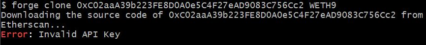

# forge clone

forge clone 命令可用于克隆已经验证的合约，并以 forge 自己的文件管理方式创建项目
默认情况下将从 ETH 主网的 etherscan 上获取数据

格式:

```bash
 forge clone <address> <repostory-name>
```

- 效果:从 Etherscan 主网获取到已验证的<address>地址的合约,并创建名为<repostory-name>的目录保存

实例：

```bash
 forge clone 0xC02aaA39b223FE8D0A0e5C4F27eAD9083C756Cc2 WETH9
```

# 常见错误

- 处理场景：未创建 foundry 项目时执行上述命令

  - 无效的 Etherscan api

    

  - 原因：一般项目执行 forge clone 时会读取当前目录 forge 仓库中的 forge.toml 文件。而此处未创建项目的情况下无任何配置文件读取。
  - 解决办法:
    使用-e 指令指定 etherscan api key (此方法不会主动在新创建的 foundry.toml 中添加入私人 apikey)
    ```bash
    forge clone 0xC02aaA39b223FE8D0A0e5C4F27eAD9083C756Cc2 WETH9 -e your-etherscan-api
    ```
