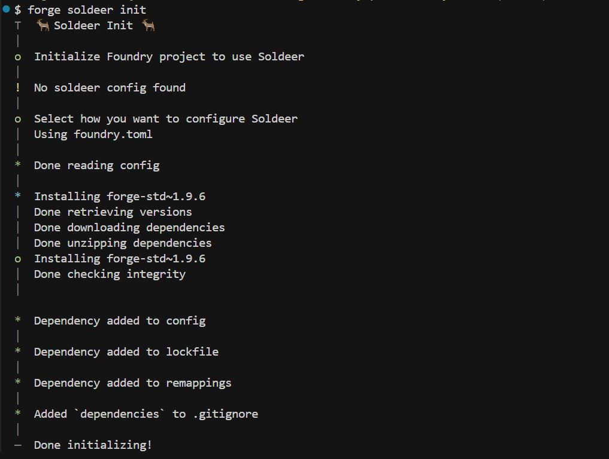

# soldeer 一个 solidity 包管理工具

# 常见错误

- 处理场景
  - 在原生 git bash 环境中**初次**调用 forge soldeer init 无法完成初始化
    
    原因: git bash 原生的字符集以及输入支持有隐藏问题,尝试使用 vscode 等嵌入的 terminal 调用 bash 执行命令。去除隐藏字符问题
    解决效果图:
    
