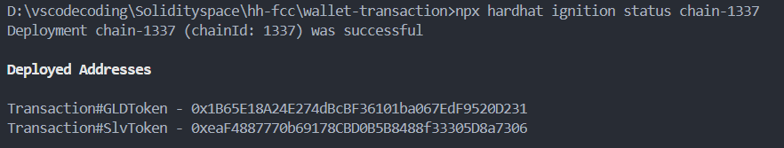
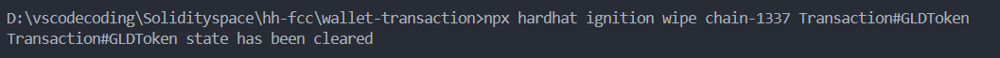
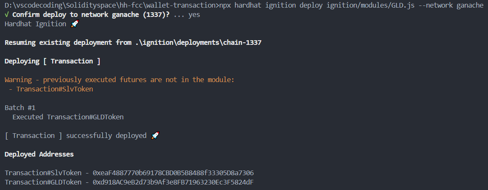

ignition再次部署合约报错

**<u>重新部署合约时，由于ignition有记录部署过本合约而拒绝重新部署</u>**

```
[ Transaction ] reconciliation failed ⛔

The module contains changes to executed futures:

Transaction#GLDToken:

- From account has been changed from 0x0988258112531ef09ebfbdb5a0b5a537bc4b860c to 0x373d36662619ed994e9778c5be4f7044f005ff9b

Consider modifying your module to remove the inconsistencies with deployed futures.
```

解决方法：

```
npx hardhat ignition wipe deploymentId futureId
```

Hardhat官方说明文档

[Handling errors | Ethereum development environment for professionals by Nomic Foundation](https://hardhat.org/ignition/docs/guides/error-handling#wiping-a-previous-execution)

部署环境说明：

Ganache，非公链

#### <mark>补充说明</mark>

> deploymentId         --目前等同于chainid，命名方式为chain-xxx
> 
> futureId                   --对应每个需要部署的合约

##### deploymentId

```npx
npx hardhat ignition deployments
```

效果如下


##### futureId

官方文档

```
npx hardhat ignition status deploymentId
```

项目中实际命令

```
npx hardhat ignition status chain-1337
```

效果如下



#### wipe命令擦除原本部署的合约记录

官方文档

```
npx hardhat ignition wipe deploymentId futureId
```

实际命令

```
npx hardhat ignition wipe chain-1337 Transaction#GLDToken
```

效果如下



#### 重新部署测试

```
npx hardhat ignition deploy ignition/modules/GLD.js --network ganache
```

效果如下



//注意部署脚本的位置替换为自己脚本的路径
