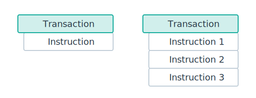

# 交易和指令 (Transactions and Instructions)

在 Solana 上，我们发送事务以与网络交互。事务包括一个或多个指令，这些指令指定要处理的操作。指令的执行逻辑存储在部署到 Solana 网络的程序中，每个程序定义了自己的指令集。
以下是关于事务处理的关键细节：

- 如果一笔交易包含多个指令，则指令将按照它们被添加到交易中的顺序执行
- 交易是“原子性”的——要么所有指令都成功处理，要么整个交易失败且不进行任何更改
  为了简化，可以将交易视为处理一个或多个指令的请求
  

将交易想象成一个包含表格的信封。每个表格都是一个指令，告诉网络我们要执行的操作。当你发送交易时，就像邮寄信封以处理表格一样。(如以太坊发起交易:执行一段指定顺序的指令集合，任何一条出错立刻回滚)

## 关键点

- Solana 交易包括在网络上调用程序的指令请求。
- 交易是原子的 - 如果任何指令失败，整个交易将失败且不会发生任何更改。
- 一笔交易的最大大小为 **1232** 字节。
- 每条指令需要 3 个信息：
  - 被调用程序所在的地址
  - 指令将发起读或写操作的目标账户列表
  - 任何被指令所需要的附加数据(如函数参数)

## 基本示例

以下是一个表示单条指令将 SOL 从发送者转移到接收者的交易的图示。
