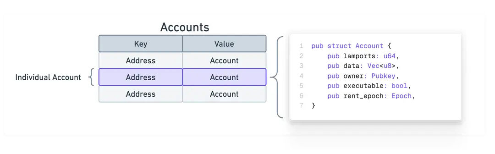
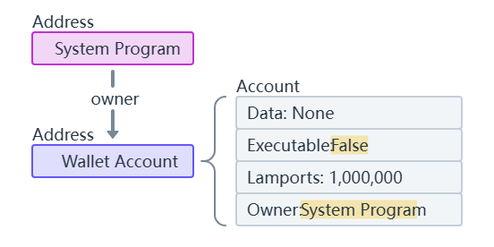
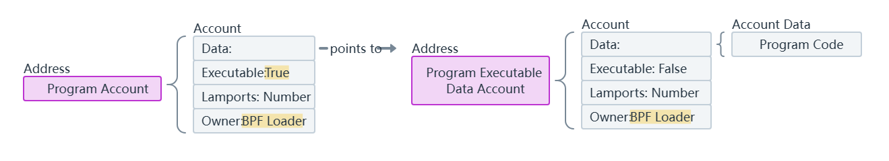
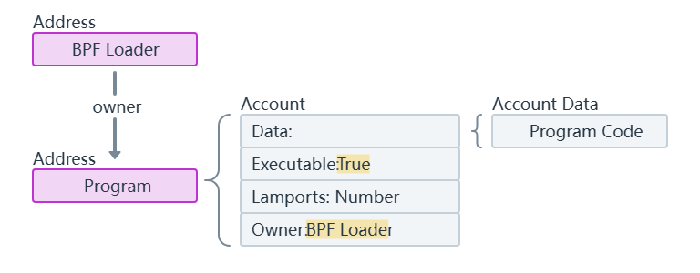
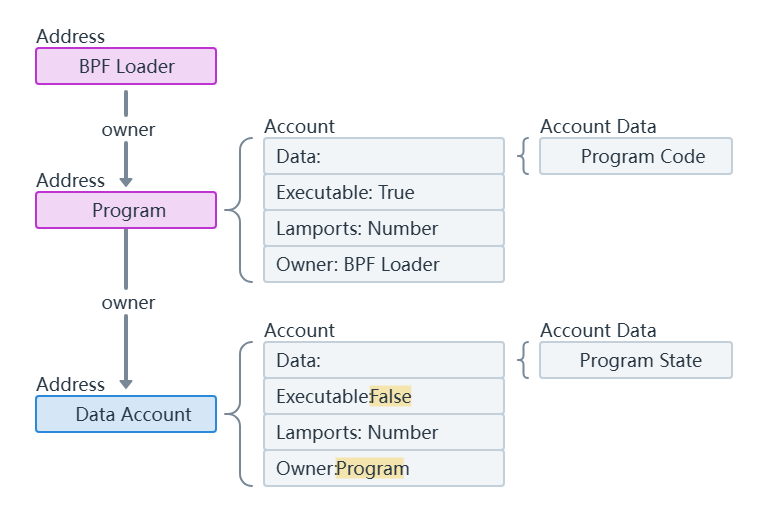

# 账户模型
[官方链接](https://solana.com/nl/docs/core/accounts)



```rust
pub struct Account{
    pub lamports:u64,
    pub data:Vec<u8>,
    pub owner:Pubkey,
    pub excutable:bool,
    pub rent_epoch:Epoch,
}
```
结构分析：


<table>
  <tr>
    <th>字段</th>
    <th>类型</th>
    <th>作用</th>
  </tr>
  <tr>
    <td>lamports</td>
    <td>u64</td>
    <td>表示账户的 SOL 余额，以 Lamports 为单位。1 SOL = 1,000,000,000 Lamports(10^9)。用于支付交易费用和账户租金。</td>
  </tr>
  <tr>
    <td>data</td>
    <td>Vec<u8></td>
    <td>存储账户的实际数据内容。对于普通账户，可以存储任意应用数据；对于程序账户，存储智能合约的二进制代码。</td>
  </tr>
  <tr>
    <td>owner</td>
    <td>Pubkey</td>
    <td>表示账户的所有者，即拥有和控制该账户的公钥。决定谁可以修改账户数据或转移余额。</td>
  </tr>
  <tr>
    <td>executable</td>
    <td>bool</td>
    <td>标识该账户是否为可执行账户。当为 `true` 时，表示账户存储的是可执行的智能合约；否则，为普通账户。</td>
  </tr>
  <tr>
    <td>rent_epoch</td>
    <td>Epoch</td>
    <td>表示账户的租金周期，用于管理账户的存储租金。帮助系统确定是否需要收取新的租金或清除未支付租金的账户。</td>
  </tr>
</table>

### 关键字说明

• **lamports (`u64`)**：
  • **类型**：无符号 64 位整数 (`u64`)。
  • **作用**：账户的 SOL 余额，以 Lamports 为单位。用于支付交易费用和账户租金，确保账户持有足够的余额以维持其在区块链上的存在。

• **data (`Vec<u8>`)**：
  • **类型**：动态字节向量 (`Vec<u8>`)。
  • **作用**：存储账户的实际数据。对于普通账户，可以存储任意应用数据，如代币余额、NFT 元数据等；对于程序账户，存储智能合约的二进制代码，决定账户的行为和功能。

• **owner (`Pubkey`)**：
  • **类型**：公钥 (`Pubkey`) <mark>--solana自定义类型，非rust原生</mark>。
  • **作用**：标识账户的所有者。只有所有者（或被授权的程序）才能修改账户数据或转移账户余额。公钥用于验证交易的签名，确保账户的安全性和控制权。

• **executable (`bool`)**：
  • **类型**：布尔值 (`bool`)。
  • **作用**：标识账户是否为可执行账户。当设置为 `true` 时，表示该账户存储的是可执行的智能合约；否则，为普通账户，用于存储数据和资产。

• **rent_epoch (`Epoch`)**：
  • **类型**：Epoch 类型，表示区块链的一个时间周期<mark>--solana自定义类型，非rust原生</mark>。
  • **作用**：用于管理账户的存储租金。系统根据账户的 `rent_epoch` 来确定是否需要收取新的租金，或者是否因未支付租金而清除账户数据，以优化存储资源的使用。
  >rent_epoch ：这是从 Solana 有定期从账户扣除 lamports 的机制时遗留下来的一个旧字段。虽然这个字段在 Account 类型中仍然存在，但由于租金收集已被弃用，它不再被使用。

### 示例

假设你有一个 Solana 账户，其 `Account` 结构体实例可能如下所示：

```rust
let account = Account {
    lamports: 1_000_000_000, // 1 SOL
    data: vec![0, 1, 2, 3],  // 存储的数据
    owner: "G1234567890ABCDEF1234567890ABCDEF1234567890ABCDEF1234567890ABCDEF".parse().unwrap(), // 所有者公钥
    executable: false,       // 普通账户
    rent_epoch: 123,         // 当前租金周期
};
```

## 原生程序(Native Programs)
>以下大部分为对solana官方文档的翻译，如有谬误请联系指正！
  #### 系统程序：
  1.创建链上所有的新账户

  2.为账户分配数据空间

  3.转移账户所有权到自定义程序中

  #### BPF加载器
  全称Berkeley Packet Filter Loader（伯克利包过滤器加载器），但在Solana中演变为自定义程序的托管者
  1.所有已部署的自定义程序的所有者

  2.处理程序部署和升级 


- ### 系统程序(System Program)
  所有在 Solana 上的“钱包”账户都只是由系统程序拥有的账户。这些账户中存储的 lamport 余额代表钱包拥有的 SOL 数量。只有由系统程序拥有的账户才能用作交易费用支付者。

- ### BPF Loader
  BPF 加载器是网络上所有自定义程序的所有者，不包括其他原生程序。它负责部署、升级和执行自定义程序。
<hr/>

##  系统变量账户(Sysvar Accounts)
Sysvar 账户是位于预定义地址的特殊账户，提供对集群状态数据的访问。这些账户会动态更新关于网络集群的数据。您可以在[此处](https://docs.anza.xyz/runtime/sysvars)找到 Sysvar 账户的完整列表。


## 自定义程序(Custom Programs)
  在 Solana 上，“智能合约”被称为程序。程序是包含可执行代码的账户。您可以通过“可执行”标志设置为 true 来识别程序账户。
  程序被部署到网络中，可以被用户和其他程序调用以执行它们的指令。
## 程序账户(Program Account)
当新的程序目前在 Solana 上部署时，技术上会创建三个独立的账户：
- 程序账户：代表链上程序的账户。此账户存储可执行数据账户的地址（存储编译后的程序代码）以及程序的更新权限（有权对程序进行更改的地址）。
- 程序可执行数据账户：包含程序可执行代码的账户。
- 缓冲账户：在程序部署或升级期间创建的临时账户，用于存储程序的执行代码。成功部署后，代码将被移动到程序执行数据账户，缓冲账户将被关闭。

例如，以下是 Token Extensions Program Account 及其对应的 Program Executable Data Account 在 Solana Explorer 中的链接。

为了简单起见，你可以将程序账户视为程序本身。当调用程序的指令时，你指定程序账户的地址（通常称为“程序 ID”）。关于两个独立账户的详细信息主要是为了理解程序是如何部署和升级的。


## 数据账户(Data Account)
Solana 上的程序是“无状态的”，这意味着程序账户仅存储可执行代码，不存储用于读取的数据。
为了维护状态，程序定义指令以创建由程序拥有的单独账户。每个账户都有自己的唯一地址，可以存储程序定义的任何任意数据。

注意，只有系统程序可以创建新的账户。一旦系统程序创建了账户，它就可以将新账户的所有权转让给另一个程序。
换句话说，为自定义程序创建数据账户需要两个步骤：

1.调用系统程序创建账户，然后将其所有权转让给自定义程序

2.调用现在拥有账户的自定义程序，然后初始化程序指令定义的账户数据

这个账户创建过程通常被抽象为单一步骤。