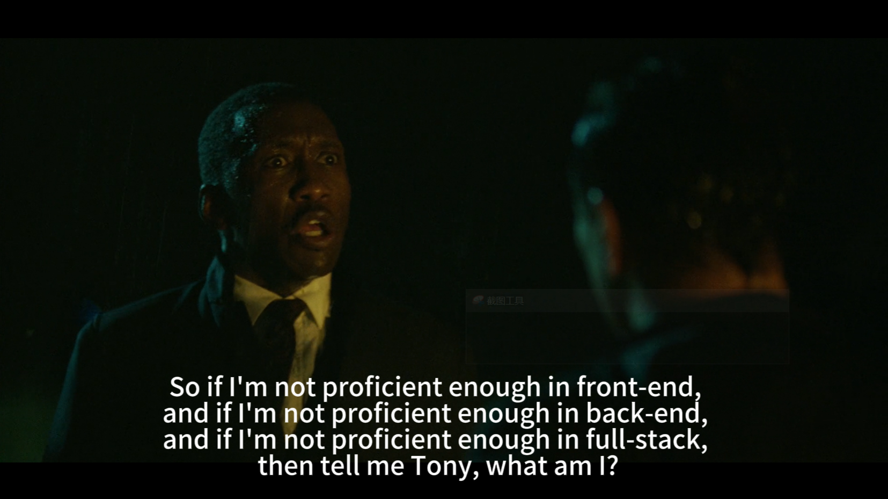

# 免责声明

本站为[**个人博客**](index.html)，分享记录个人学习过程和相关信息。所有内容如有外部来源，将会在分享时明确标注，如有遗漏，请通过[邮件](mailto://web3test1@outlook.com)联系以便及时删除。未标注来源的部分（如代码等），读者可以自由使用，但需自行承担使用可能带来的后果。关于信息的准确性请读者自行鉴别，这不是科普，绝大多数情况下无法做到精准描述。

# About languages
If you have some difficulties in reading Chinese, usually because you are not a native Chinese speaker. It is recommended to use the Chrome plugin [Immersive Translate](https://immersivetranslate.com/en/) to read this blog. Welcome everyone to learn about my learning experience.

# 关于个人

我是 **徐** ，此博客旨在分享技术学习和个人见解。欢迎查阅我的简历，部分信息[在此](./Personal/简历.md)。

希望能找到一个对于区块链行业有热忱的团队一起奋进。如果我的技术栈刚好符合你的需求，可以通过[邮件](mailto://web3test1@outlook.com)与我进一步联系。部分技术栈不匹配的问题也可以后续跟进。
