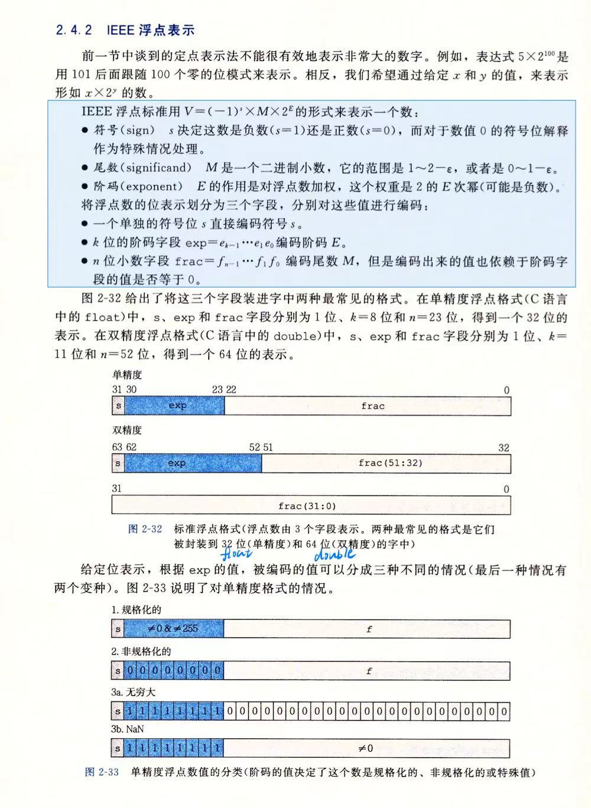
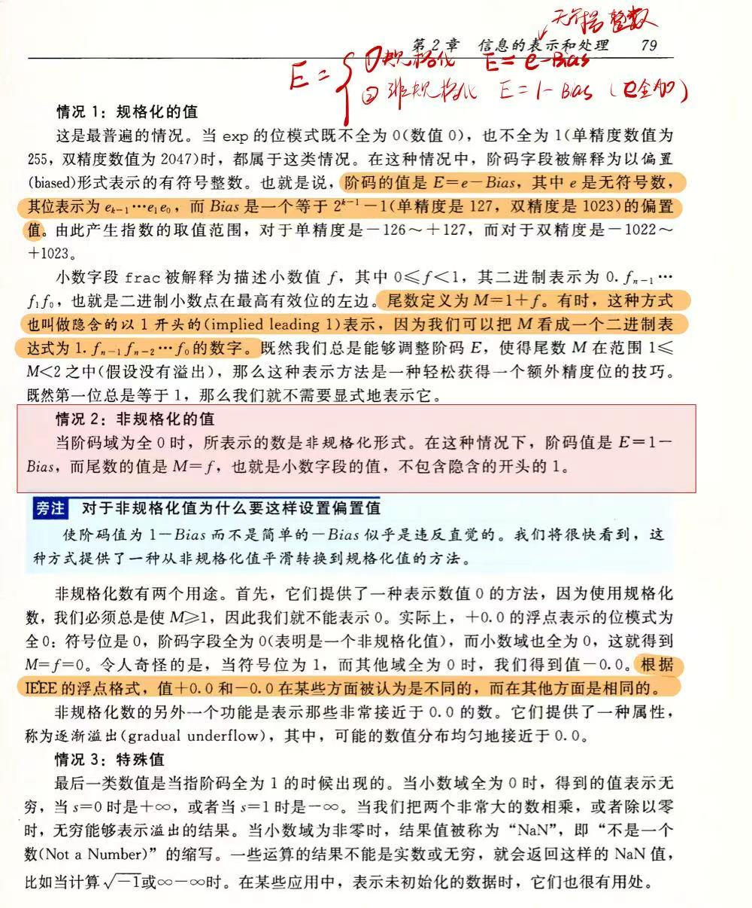

# rust库中默认内置的变量

---

## 一、标量类型（Scalar Types）

## 1. 整数类型（Integer）
Rust 的整数类型根据**符号**和**位宽**分类，命名格式为 `[u|i][位数]`：

| 类型   | 位数 | 范围                                     | 示例值         | 典型场景                 |
|--------|------|------------------------------------------|----------------|--------------------------|
| `i8`   | 8    | -128 ~ 127                               | `-5i8`         | 小范围有符号整数         |
| `u8`   | 8    | 0 ~ 255                                  | `255u8`        | 字节处理、颜色值         |
| `i16`  | 16   | -32,768 ~ 32,767                         | `30000i16`     | 中等范围有符号整数       |
| `u16`  | 16   | 0 ~ 65,535                               | `65535u16`     | Unicode 字符码点（如 `'\u{2764}'`） |
| `i32`  | 32   | -2,147,483,648 ~ 2,147,483,647           | `42`（默认推断） | 通用整数，性能最佳       |
| `u32`  | 32   | 0 ~ 4,294,967,295                        | `1_000_000u32` | 大范围无符号计数         |
| `i64`  | 64   | -9,223,372,036,854,775,808 ~ 9,223,372,036,854,775,807 | `-9_223_372_036i64` | 时间戳、大数值计算       |
| `u64`  | 64   | 0 ~ 18,446,744,073,709,551,615           | `18_446_744u64` | ID 生成、超大计数        |
| `isize`| 平台相关（通常 32/64 位） | 与指针大小相同 | `-10isize`    | 集合索引、内存偏移量     |
| `usize`| 平台相关（通常 32/64 位） | 与指针大小相同 | `0usize`     | 集合长度、内存地址       |

**关键特性**：
- **默认类型**：未标注时，整数字面量默认推断为 `i32`。
- **进制表示**：
  ```rust
  let decimal = 98_222;      // 十进制：98222
  let hex = 0xff;            // 十六进制：255
  let octal = 0o77;          // 八进制：63
  let binary = 0b1111_0000;  // 二进制：240
  let byte = b'A';           // u8 类型字节：65
  ```
- **溢出处理**：Debug 模式下溢出会 panic，Release 模式下自动按补码循环（需显式处理用 `Wrapping` 类型）。

---

## 2. 浮点类型（Floating-Point）
Rust 提供两种精度浮点数，遵循 IEEE-754 标准：

关于浮点类型是一种以**表达式**形式存储在内存中的变量

图片来源 ：csapp + 个人学习记录

 

| 类型   | 位数 | 精度      | 范围                  | 示例值       | 场景         |
|--------|------|-----------|-----------------------|--------------|--------------|
| `f32`  | 32   | 6-7 位小数 | ±3.4×10³⁸ ~ ±1.7×10³⁸ | `3.14f32`    | 图形计算、嵌入式 |
| `f64`  | 64   | 15-17 位小数 | ±1.7×10³⁰⁸ ~ ±1.1×10³⁰⁸ | `2.718`（默认） | 科学计算、通用 |

**重要特性**：
- **默认类型**：未标注时，浮点字面量默认推断为 `f64`（因现代 CPU 高效支持）。
- **数值运算**：
  ```rust
  let sum = 5.0 + 10.0;     // f64
  let difference = 95.5 - 4.3;
  let product = 4.0 * 30.0;
  let quotient = 56.7 / 32.2;
  let remainder = 43.0 % 5.0;
  ```
- **陷阱**：浮点数存在精度误差，**避免直接判等**：
  ```rust
  // ❌ 错误写法
  assert!(0.1 + 0.2 == 0.3);
  
  // ✅ 正确做法
  let tolerance = 1e-10;
  assert!((0.1 + 0.2 - 0.3).abs() < tolerance);
  ```


---

## 3. 布尔类型（Boolean）
- **类型名**：`bool`
- **值域**：`true` 或 `false`
- **内存占用**：1 字节
- **使用场景**：条件判断、逻辑运算
  ```rust
  let is_rust_cool = true;
  let is_heavy: bool = 10 > 5;  // 自动推断为 true
  ```

---

## 4. 字符类型（Character）
- **类型名**：`char`
- **内存占用**：4 字节（存储 Unicode 标量值）
- **值域**：U+0000 ~ U+D7FF 和 U+E000 ~ U+10FFFF
- **表示方式**：单引号，支持 Unicode 转义：
  ```rust
  let c = 'z';
  let emoji = '🚀';            // 直接输入 Unicode
  let heart = '\u{2764}';     // Unicode 转义：❤
  ```

---

## 二、复合类型（Compound Types）

## 1. 元组（Tuple）
- **定义**：固定长度、可包含不同类型的集合。
- **内存布局**：元素紧密排列，无额外开销。
- **示例**：
  ```rust
  let tup: (i32, f64, bool) = (500, 6.4, true);  // 显式类型标注
  let (x, y, z) = tup;                            // 解构赋值
  let first = tup.0;                              // 索引访问
  ```
- **空元组**：`()` 表示“无返回值”，是函数的默认返回类型。

---

## 2. 数组（Array）
- **定义**：固定长度、相同类型的集合，栈上分配。
- **适用场景**：已知元素数量的数据集（如月份名称）。
- **示例**：
  ```rust
  let months = ["Jan", "Feb", "Mar"];         // 类型推断为 [&str; 3]
  let arr: [i32; 5] = [1, 2, 3, 4, 5];       // 显式标注
  let zeros = [0; 10];                        // 初始化 10 个 0：[0, 0, ..., 0]
  let first = arr[0];                         // 索引访问（编译时检查越界）
  ```
- **越界访问**：运行时 panic（如 `arr[5]`）。

---

## 三、类型转换与处理

## 1. 显式类型转换（`as`）
```rust
let x = 1000i32;
let y = x as u64;     // 安全转换
let z = x as u8;      // 可能丢失数据（1000 → 232）
```

## 2. 处理不同类型运算
需手动统一类型：
```rust
let a = 10i32;
let b = 100u32;
let sum = a as i64 + b as i64;  // 统一为 i64 避免溢出
```

## 3. 类型推断与标注
```rust
let x = 42;          // 默认推断为 i32
let y: u8 = 10;      // 显式标注为 u8
let z = x + y;       // ❌ 错误：类型不匹配
let z = x + y as i32; // ✅ 正确
```

---

## 四、最佳实践与常见问题

## 1. 如何选择整数类型？
- **通用场景**：优先使用 `i32`（性能最优）。
- **内存敏感**：`u8`、`i16`（如网络协议）。
- **大集合索引**：`usize`（与平台指针同宽）。

## 2. 为什么浮点数比较需要特殊处理？
- 浮点运算存在精度损失，直接判等可能失败。
- 使用误差范围（epsilon）或专用库（如 `approx`）。

## 3. 何时使用数组 vs 向量（`Vec<T>`）？
- **数组**：长度固定、栈分配（高效）。
- **向量**：动态长度、堆分配（灵活）。

---

## 五、代码示例

```rust
fn main() {
    // 整数操作
    let decimal = 98_222;             // i32
    let hex = 0xff;                   // i32
    let byte = b'A';                  // u8
    let max_u32 = u32::MAX;           // 4,294,967,295
    
    // 浮点运算
    let x = 2.0;                      // f64
    let y: f32 = 3.0;                 // f32
    let result = x + (y as f64);      // 统一类型
    
    // 布尔逻辑
    let is_greater = 10 > 5;          // true
    
    // 字符与Unicode
    let emoji = '🚀';
    let heart = '\u{2764}';
    
    // 元组和数组
    let tup = (500, 6.4, true);
    let arr = [1, 2, 3, 4, 5];
    let first_element = arr[0];
}
```
